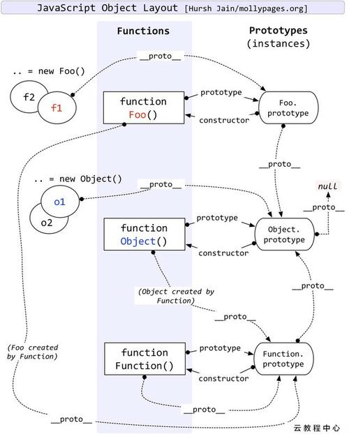

# 镇题之宝
先留下镇题之宝，这张图很清晰的介绍了JS原生链的所有关系



留下镇殿链接，个人认为一切博客描述都没有官方讲的透彻：https://developer.mozilla.org/zh-CN/docs/Web/JavaScript/Inheritance_and_the_prototype_chain

# 内容

众所周知，JS中的继承是使用原生链实现的，那这个原生链是如何实现继承呢。

当我们定义一个构造函数并使用它实例化出一个对象
```js
function foo() {}
let a = new foo()
console.dir(a)

------console结果------
a: {
  __proto__: {  // 这个__proto__是什么呢
      ...
  }
}
```
通过实验我们可以知道，JS是使用`__proto__`来实现继承的，将上面代码改造如下
```js
function foo() { this.key1 = 'c' }
let b = { key1: 'a', key2: 'b' }
let a = new foo()
a.__proto__ = b
console.log(a.key1, " ", a.key2)
console.dir(a)

------console结果------
c b
a: {
  key1: 'c'
  __proto__: {
    key1: 'a',
    key2: 'b',
    __proto__: ...
  }
}
```
我们发现a这个对象中并没有key2属性，但是由于我们将`__proto__`指向b时，对于a而言，它的父亲对象就变成了b，然后就继承了b的属性，允许使用父亲对象的属性，但是当a有key1时，又没有继承b的key1，或者说a的相同属性覆盖了从b那里继承过来的属性。

当我们通过a.key2访问key2时，JS做了这样子的逻辑：先看当前对象有没有key2，没有的话，沿着`__proto__`去看父亲对象b有没有，发现有父亲对象b有key2这个属性，a就直接返回了b.key2的值。

同理key1也是如此，只是key1在当前对象就已经存在了，所以直接返回a.key1的值，不会再沿着`__proto__`去查找了

大概是如下的流程(伪代码)：
```js
let a = test()  // 假设test是一个很复杂的构造函数，会有很多__proto__，也就是父亲的父亲的父亲的父亲的...有很多链
let b = a
while(b.key === undefined && b.__proto__ !== undefined) {
  b = b.__proto__
}
console.log(b.key)
```

到这里我们基本知道JS是如何去继承一个对象属性的，但是大家也会存在疑惑，上面偶尔会出现的`prototype`是干什么用的，这个涉及到JS更深层次的一些东西

## 万物皆对象，蛋生鸡还是鸡生蛋

在JS中任何东西都是一个对象，函数也是一个对象。在JS中只要是函数对象必有一个属性为`prototype`，如果使用当前这个函数当作构造函数去执行`new`操作，那么生成对象的`__proto__`属性则是指向`prototype`，所以`prototype`也是为了继承为存在的。

```js
function foo() {}
let a = new foo()
a.__proto__ === foo.prototype  // 结果为true
```

可以理解的是：将函数工厂当作一个手机制作工厂(用来生产某个特定的手机)，prototype就相当于这些手机共同使用的芯片架构，

### 这其中JS做了什么特殊处理呢？

比如我是用如下语句：
```js
function foo() {
  this.a = 'b'
  this.b = 'c'
}
```
上面这条语句会被JS解释器处理成一个函数对象，然后foo这个变量指向函数对象的地址。

生成函数对象的同时会给该函数对象设置一个属性`prototype`指向一个对象，这个对象是在定义这个函数时，由JS解释器根据该函数内容生成的一个很特殊的对象，同时会设置一个`contructor`属性指向该函数本身，这个时候大家会发现`prototype的结构其实已经很像我们类了`。

一般情况下`prototype`对象只包含两个属性`constructor`和`__proto__`，其中`__proto__`是指向`Object.prototype`

结果如下：
```js
foo: {  // 函数对象
  prototype: {  // 一个可继承访问的对象
    contructor: foo  // 指向foo函数对象地址
    __proto__:  // 则是指向Object.prototype
  }
}
```

为什么`foo.prototype.__proto__`会指向`Object.prototype`

这是因为`foo.prototype = new Object()`
所以`foo.prototype.__proto__ = Object.prototype`

# 函数调用的真相

```js
let callObj = {
  key: 'key1'
}
function foo(a) {
  console.log(this)
  console.log(a)
}
foo.apply('f')
foo.call(callObj, 'f')

------console结果-----
undefined
'f'

{ key: 'key1' }
'f'
```

当执行`foo(a)`时其实执行的是`foo.apply(null, [a])`或者是`foo.call(null, a)`
